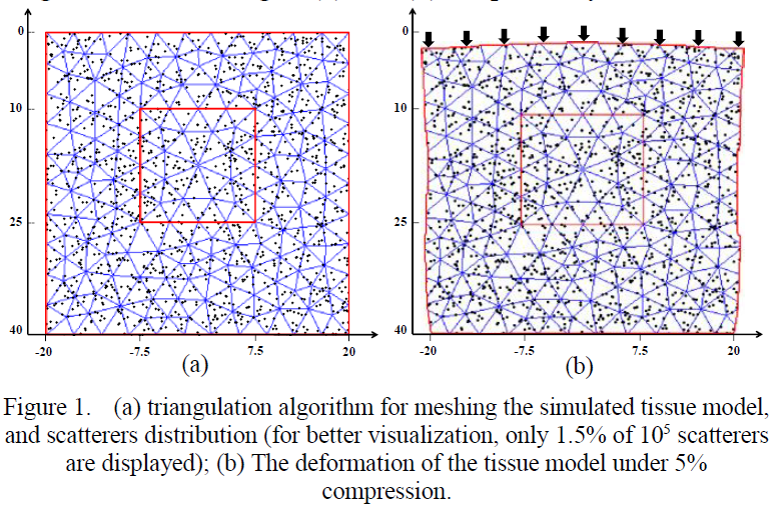
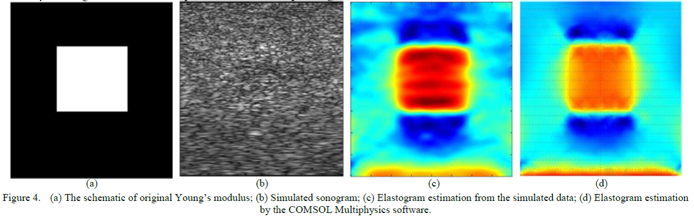

# 3D Tissue Deformation using COMSOL Multiphysics Software to Obtain RF Ultrasound Signals for US Elastography
For centuries, palpation have been used by physicians as a main diagnostic tool for inspection of many diseases which influence the tissue mechanical properties such as elastic modulus or Young’s modulus. Therefore, this method is useful for tumor detection. The relative displacements of the tissue under compression can indicate the strain. For determining the tissue displacement in different depths of body, radio-frequency (RF) ultrasound signals can be used. In this paper, at first a 3D tissue model was simulated by the COMSOL Multiphysics software and the scatterers’ position before and after compression were calculated. Then according to the position of the scatterers, RF ultrasound signals were simulated by the Field II program. Afterwards, the corresponding RF ultrasound signals in pre and post-compression states were segmented and the delay which is proportional to the segment’s axial displacement is calculated for each segment by the conventional method of cross-correlation function. Finally, the strain image was calculated from the displacements by the gradient method, and compared with the strain image which was generated by the COMSOL Multiphysics software. Results show that, this 3D tissue deformation modeling is a useful method for generating strain images.

## A MATLAB-based toolbox was developed for medical ultrasound images and elastogram analysis

## Triangulation algorithm for meshing the simulated tissue model, and scatterers distribution

## As opposed to sonogram, elastogram succeeds in revealing the modelled lesion/tumor

# How to cite
* F. Afdideh, "3D Tissue Deformation using COMSOL Multiphysics Software to Obtain RF Ultrasound Signals for US Elastography", to be published.
